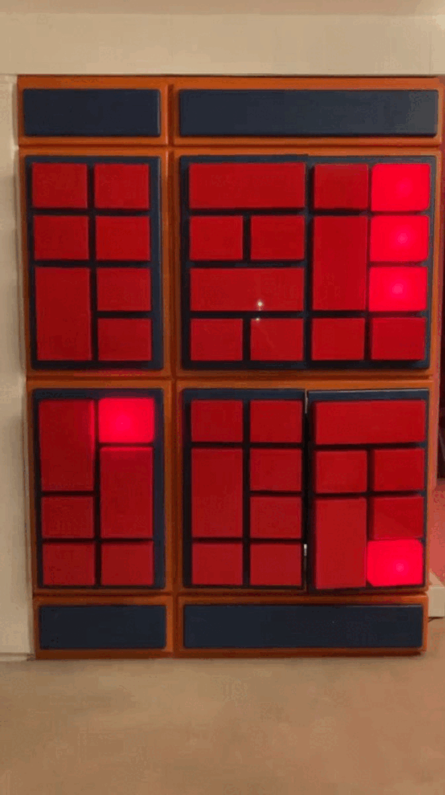

## Programmierte Lichttastatur
> Utz Kampmann

  

This repo contains the documentation about the restoration of this artwork originally made by Utz Kampmann in the late 1960s.

The piece consists of the cabinet shown above. Each door contains eight light bulbs illuminating acrylic diffusers.
The cabinet has 12 doors in total. Six on each side.
The original mechanism consisted of several [barrel organ](https://en.wikipedia.org/wiki/Barrel_organ#Operation)
like mechanisms acting as switches to switch 220V live wires to each light bulb.

As most of the original electronics inside this artwork are broken, missing and dangerous, I had decided to at least restore the original light patterns.

To do this, each bulb is replaced with a 3W LED mounted on an aluminium heat sink.
Each door contains eight LEDs and a controller board.
The controller boards will receive a [DMX](https://en.wikipedia.org/wiki/DMX512) signal and 12V power.

Due to space limitations for the wiring, each door has an additional companion board mounted inside the cabinet. 
The companion board acts as a DMX splitter with galvanic isolation to relay the DMX signals into the door.

One of the doors is equipped with a main controller which will broadcast the DMX signal.
The main controller is also equipped with multiple push buttons to switch between different DMX light shows.

## Build Instructions
The complete cabinet requires:
- 12 Splitters
- 12 Door CTRLs
- 1 DMX CTRL

The Door CTRL boards must be flashed with the [led](./led) firmware.
The DMX CTRL board must be flashed with the [dmx](./dmx) firmware.
